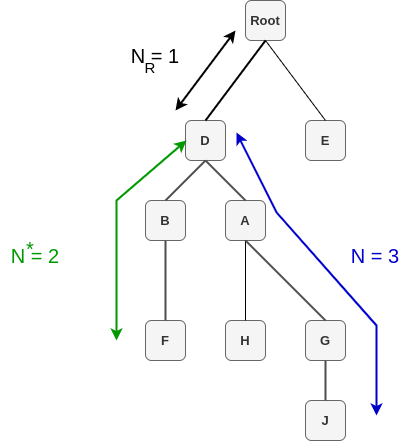

# Concept similarity (consim)
ConSim is a python library for concepts similarity within an ontology.
It consists in calculating the similarity between two concepts of an ontology (Taxonomy). This implementation is based on the work of Wu Zhibiao.

Formula: `ConSim(F, J) = 2*N_R/(N^*+N+2*N_R)`
- D is the common ancestor of concept F and J
- N_R is the distance from this common ancestor D to the root
- N^* is the distance from F to the common ancestor D
- N is the distance from J to the common ancestor D

## Reference

`
@inproceedings{verbssemantics1994,
	author = {Wu, Zhibiao and Palmer, Martha},
	title = {Verbs Semantics and Lexical Selection},
	year = {1994},
	publisher = {Association for Computational Linguistics},
	address = {USA},
	url = {https://doi.org/10.3115/981732.981751},
	pages = {133–138},
	numpages = {6},
	location = {Las Cruces, New Mexico},
	series = {ACL '94}
}
`

# How to use

`` consim(rdf_file, concept1, concept2):numeric``